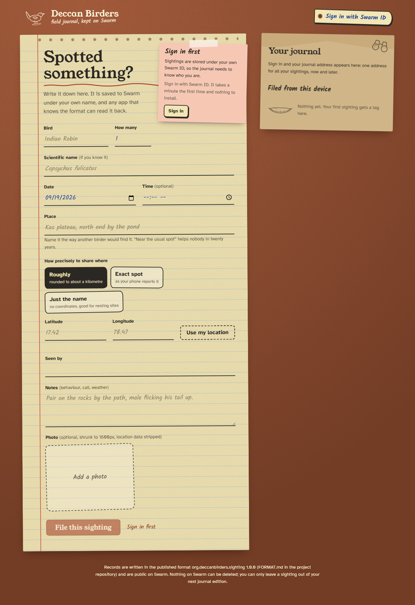

# Deccan Birders: take your records with you

The Deccan Birders have kept sighting records since 1998 and lost them to three apps: a forum that
closed, a Facebook group that ate the photos, and a birding app that was bought, shut down, and
left a CSV where the location column said "near the usual spot".

Meera's one rule for the next move: **whatever writes the records must not be the only thing that
can read them.**

This repository has three pieces:

| | What it is | Where |
|---|---|---|
| **Field Journal** | The app a birder uses to file a sighting. Signs in with Swarm ID and stores each sighting on Swarm under the birder's own identity. | [`apps/writer`](apps/writer) |
| **Almanac** | A separate reader, on its own origin, that shows anyone's sightings from a journal address. It shares no code with the Field Journal. | [`apps/reader`](apps/reader) |
| **The format** | The published description a fourth app relies on, with JSON Schemas, fixtures and test vectors. | [`FORMAT.md`](FORMAT.md), [`packages/format`](packages/format) |

Plus [`tools/read-sightings`](tools/read-sightings), a Node command-line reader that imports
nothing from this repository. It shows that the data and `FORMAT.md` are enough on their own.

Meera files a sighting in the Field Journal. She sends the group her journal address. They open it
in Almanac, or with `read-sightings`, or with whatever someone writes next year from `FORMAT.md`.
Nobody exports anything, because the records were never inside the app.

## What it looks like

| Field Journal (signed out, live Swarm ID) | Almanac, reading a journal | Almanac, one sighting |
|---|---|---|
|  |  |  |

The Almanac screenshots read the sample journal served by `npm run mock:gateway`
(illustrative records and drawn placeholder photos), not real sightings.

## How it fits together

```
 Field Journal (apps/writer)                              Swarm                             Almanac (apps/reader)
 ───────────────────────────                              ─────                             ─────────────────────
 sign in with Swarm ID
 check: signed in? can upload? online?  ── no ──► stop, show the specific reason
      │ yes
 photo bytes ─────────── bytes upload ───────────► /bytes/<photo>  ◄────── GET /bytes ──── photo, typed by the record
 sighting JSON {format, formatVersion, …} ────────► /bytes/<record> ◄────── GET /bytes ──── validate format + version
 journal JSON {entries:[…], previous} ────────────► /bytes/<journal> ◄───── GET /bytes ──── list of sightings
 feed update #n = timestamp ‖ journal ref ─ SOC ──► /chunks/<soc n> ◄───── GET /chunks ─── find latest n by probing
      signed by your Swarm ID app key                     ▲
                                                          └── the journal address (owner + fixed topic) never changes
```

- **Who pays:** if your Swarm ID has a drive (a postage batch), it pays. If it does not, which is every
  first-time user, the public subsidised gateway `https://api.gateway.ethswarm.org/` stamps the upload.
  You can also point uploads at your own Bee node and batch.
- **Who signs:** the journal pointer is a feed update signed by your Swarm ID app key, inside the Swarm
  ID iframe. This app never sees a private key.

## Run it

Node 22.12 or newer.

```sh
npm install
npm run dev:writer     # Field Journal on http://localhost:5173
npm run dev:reader     # Almanac on http://localhost:5174 (a different origin on purpose)

npm run read -- --owner 0x<journal address>          # the command-line reader
npm run read -- --owner 0x<journal address> --json --photos ./photos
```

No node and no gift code are needed: sign in with Swarm ID and the subsidised gateway covers the
uploads. To use your own node instead, open **Where uploads go** in the Field Journal and pick a
usable batch. The node has to allow the page's origin, for example
`--cors-allowed-origins="http://localhost:5173,http://localhost:5174"`.

Configuration is in `apps/writer/.env.example` and `apps/reader/.env.example`. Every value is a
public URL; there are no secrets anywhere in this project.

### Try the readers without a network

```sh
npm run mock:gateway   # serves a signed sample journal at http://127.0.0.1:4555 and prints its address
npm run dev:reader     # then open the Almanac link it prints
npm run read -- --owner 0x<printed address> --gateway http://127.0.0.1:4555
```

The mock gateway holds data laid out exactly as FORMAT.md describes, signed by a
throwaway key it makes at start-up. Nothing it serves is a real sighting.

### Checks

```sh
npm run typecheck      # tsc, all workspaces
npm run lint           # eslint, including rules that keep the reader independent
npm test               # vitest: format rules, feed vectors, capability gate, error mapping, bee-js interop, end-to-end readers
npm run build          # both apps
npm run audit:checks   # re-verifies the checks below from the source (and the built reader bundle)
npm run check          # all of the above
```

## How each check is met

Every row names the code a reviewer should open, and how the repo stops it regressing
(`npm run lint` and `npm run audit:checks` both fail on a break).

| # | Check | How it is met | Where to look | Enforced by |
|---|---|---|---|---|
| 1 | **Every write path is gated on a capability check** | There are exactly four write calls in the whole repo: `client.uploadData` and `writer.uploadRawPayload` (the only `makeSequentialFeedWriter`) in `uploader.swarmId.ts`, and `bee.createTag` + `bee.uploadData` in `uploader.ownNode.ts`. Both files are called only from `createUploader()`, and each of its two methods (`uploadBytes`, `publishJournalPointer`) begins with `await gate()`, which runs `checkUploadCapability()` and **throws before the upload call** unless: online, Swarm ID loaded, `connectionInfo.identity` set, `connectionInfo.canUpload` true and `uploadMode !== 'unavailable'`, and, for your own node, reachable with a usable batch. `connectionInfo` is re-read on every call. `fileSighting()` and `retryJournal()` also check first and stop before any read or write. The File button is disabled with the reason shown. The readers, the CLI and the offline mock gateway never write (the mock answers 405 to anything but GET). | `apps/writer/src/swarm/uploader.ts` → `createUploader`, `gate`; `swarm/capability.ts` → `checkUploadCapability`; `fileSighting.ts` → `fileSighting`, `retryJournal`; `components/CapabilityNote.tsx` → `readiness` | ESLint `no-restricted-syntax` bans upload calls, feed/SOC writer factories and `createTag` outside the two branch files; audit check 1; `apps/writer/test/gate.test.ts` proves no upload call is made when signed out, without a drive, with a failed stamper or offline |
| 2 | **A route for users with no stamp** | `new SwarmIdClient({ subsidisedGatewayUrl: 'https://api.gateway.ethswarm.org/' , … })`, so a first-time Swarm ID with no drive gets `uploadMode: 'subsidised'`. Your own Bee node is an optional second route. | `apps/writer/src/swarm/client.ts` → `getSwarmId`; `config.ts` → `subsidisedGatewayUrl` | audit check 2 |
| 3 | **Format name and version inside the uploaded bytes** | `encodeSighting()` builds `{ format: 'org.deccanbirders.sighting', formatVersion: '1.0.0', … }` (those two keys first), validates it and returns `TextEncoder().encode(JSON.stringify(record))`; `fileSighting()` uploads exactly those bytes. Journals carry `org.deccanbirders.journal` the same way. | `packages/format/src/codec.ts` → `encodeSighting`, `encodeJournal`; `apps/writer/src/fileSighting.ts`; `FORMAT.md` §1–2 | audit check 3; `packages/format/test/format.test.ts` |
| 4 | **Reader reaches Swarm without importing the writer** | Almanac is its own workspace, Vite app and origin. Its only workspace dependency is `@deccan-birders/format` (no runtime deps, no app code); the rest is React and `@noble/hashes`/`@noble/curves`. No tsconfig `paths`, no Vite aliases, no shared utilities. Swarm access is plain `fetch` GETs. The CLI imports nothing from the repo. | `apps/reader/package.json`; `apps/reader/src/journal.ts` → `loadJournalByOwner`; `swarm/http.ts` → `getWithTimeout` | ESLint `no-restricted-imports` for the reader; audit check 4 (sources, `package.json`, and the built bundle must not contain `SwarmIdClient`/axios) |
| 5 | **Each download uses the endpoint matching its upload** | Records, photos and journals are uploaded with the bytes upload and read with `GET /bytes/<ref>`. The journal pointer is uploaded as a single-owner chunk (`POST /soc/<owner>/<id>`), which stores one chunk, so it is read with `GET /chunks/<socAddress>`: the chunk as stored, signature included (FORMAT.md §4 explains why `/feeds` and `/soc` GET are not equivalent). Nothing is a manifest; nothing reads `/bzz`. | `apps/reader/src/swarm/bytes.ts` → `downloadBytes`; `swarm/feed.ts` → `fetchFeedUpdate`; `FORMAT.md` §3.2, §4 | audit check 5 |
| 6 | **No pin or tag on any upload that can reach the gateway** | The Swarm ID branch's option type is `GatewaySafeUploadOptions = … & { pin?: never; tag?: never }` and the feed update passes only `{ index, hasTimestamp, encrypt }`. Only `uploader.ownNode.ts`, which talks only to your own node, passes `pin: true` and a tag. | `apps/writer/src/swarm/uploader.swarmId.ts` → `uploadBytesViaSwarmId`, `publishPointerViaSwarmId`; `uploader.ownNode.ts` → `uploadBytesToOwnNode` | the type; ESLint bans `pin: true`/`tag` elsewhere in the writer; audit check 6 |
| 7 | **Failures reach the screen with a distinguishing reason** | 20 failure codes, each with its own title, explanation, next step and fix button (no drive, drive expired, popup blocked, "Failed to fetch" (CORS, filter or unreachable), payload too large, rate limited, gateway 5xx, own node down, saved-but-journal-failed, …). `classifyError()` maps Swarm ID/bee-js errors onto them and `ErrorPanel` renders title, message, next step and the raw detail. The reader's `StatusNotice` does the same for 10 reader codes (a 404 and a 500 on feed update 0 read differently). | `apps/writer/src/errors.ts` → `MESSAGES`, `classifyError`; `components/ErrorPanel.tsx`; `apps/reader/src/components/StatusNotice.tsx` | audit check 7; `apps/writer/test/writer.test.ts`; `apps/reader/test/feed.test.ts` |
| 8 | **No secrets in tracked files** | Signing happens inside the Swarm ID iframe and the gateway needs no key, so there is nothing to hold. `.env*` is git-ignored except `.env.example` files, which hold only public URLs. Test and mock keys are generated at run time and never written. The 64-hex strings in `FORMAT.md` and tests are the public feed topic, identifiers, SOC addresses and example references (test vectors), not keys. | `.gitignore`; `apps/*/.env.example`; `scripts/mock-gateway.mjs` → `createThrowawaySigner` | audit check 8 scans every tracked file for private keys, PEM blocks, mnemonics, credential URLs, API tokens and gift codes |

## Things worth knowing

- **First-time users.** A new Swarm ID has no drive. With the subsidised gateway configured (the
  default), `uploadMode` is `subsidised` and filing works. Set `VITE_SUBSIDISED_GATEWAY_URL=` to empty
  and you get the `NO_DRIVE` state, with File disabled and a link to add a drive. No request is made.
- **The gateway's limits.** It ignores any batch ID you send and refuses the `Swarm-Pin`/`Swarm-Tag`
  headers (the browser reports only "Failed to fetch"). How long it keeps gateway-stamped data is its
  operator's decision. Records that must last should go through your own drive or node.
- **Location privacy.** Coordinates are shared only if you choose to, and "Roughly" rounds them to
  about a kilometre. Photos are re-drawn through a canvas, which drops EXIF, including GPS.
- **Nothing can be deleted.** Records are public and permanent for as long as their stamp is paid. You
  can leave a record out of your next journal edition; that is all.
- **One writer per journal.** The journal index is re-published in full on each filing. The next feed
  index always comes from reading the feed just before writing, never a local counter. If this device
  published a later edition than the network shows, the app waits instead of overwriting it. Filing
  from two devices at the same moment can still race; the second edition simply wins.
- **The journal address depends on the app's origin.** Swarm ID derives a key per app origin, so the
  local dev writer and a deployed writer have different journal addresses. Deploy the writer at one
  stable URL.
- **npm audit.** `@ethersphere/bee-js` 11.2.0 asks for `axios ^0.30.2`, and every axios up to
  0.32.0 carries advisories. The root `package.json` overrides it to `axios 0.34.0`, the patched
  release of the same 0.x line, so `npm audit` reports 0 vulnerabilities. The bee-js calls the app
  makes (`isConnected`, `getPostageBatch`, `getAllPostageBatch`, `createTag`, `uploadData`) were
  checked against a local stand-in node with 0.34.0, and typecheck, tests and both builds pass.
  (`npm ls axios` prints "invalid" because 0.34.0 is outside bee-js's declared range; that is what
  an override means.) One copy it cannot reach: `@snaha/swarm-id` 0.4.1 ships a pre-bundled
  `dist/swarm-id.esm.js` with its own axios 0.30.3 inlined. That copy runs only in the browser, where
  the Node-only advisories (proxy, NO_PROXY, stream limits) do not apply; it goes away when Swarm ID
  publishes a rebuilt bundle.

## Deploying

Both apps are static sites (`apps/*/dist`). For Vercel, create **two projects from the same
repository**. Each app's `vercel.json` already holds these values, so importing the repo and
setting only the Root Directory is enough; the table is what the dashboard should end up showing.

| Setting | Field Journal | Almanac |
|---|---|---|
| Root Directory | `apps/writer` | `apps/reader` |
| Include files outside the root directory in the Build Step | **On** (the default; the install runs at the repo root) | **On** |
| Framework Preset | Vite | Vite |
| Install Command | `cd ../.. && npm ci` | `cd ../.. && npm ci` |
| Build Command | `cd ../.. && npm run build -w @deccan-birders/writer` | `cd ../.. && npm run build -w @deccan-birders/reader` |
| Output Directory | `dist` | `dist` |
| Node.js Version | 22.x | 22.x |
| Environment variables | `VITE_READER_URL=https://<your Almanac domain>` (for "Open in Almanac" links). Optional: `VITE_SUBSIDISED_GATEWAY_URL`, `VITE_SWARM_ID_ORIGIN` (defaults are right) | none needed (optional `VITE_DEFAULT_GATEWAY`) |

Why the install runs at the root: the apps are npm workspaces and depend on `@deccan-birders/format`
through the root `package-lock.json`, so a plain install inside `apps/writer` would not find it.
Both apps read everything from the query string, so no rewrites are needed. Deploy Almanac first
so its URL can go into the Field Journal's `VITE_READER_URL`, and keep the Field Journal on one
stable domain: Swarm ID derives the journal address from the app's origin, so a new domain means
a new, empty journal. Preview deployments get their own URLs, so sign in on the production domain
when filing real sightings.

## Layout

```
FORMAT.md                     the published format: read this to write a fourth app
packages/format/              standalone format definition: constants, types, validators, codec,
                              JSON Schemas, fixtures. Zero runtime dependencies.
apps/writer/                  Field Journal (React, Vite, @snaha/swarm-id 0.4.1, @ethersphere/bee-js 11.2.0)
  src/swarm/client.ts         the one SwarmIdClient, with the subsidised gateway configured
  src/swarm/capability.ts     can this upload happen right now, and if not, why
  src/swarm/uploader*.ts      the only code that writes to Swarm, gated by capability
  src/swarm/journal.ts        read the latest journal from your feed; build the next edition
  src/fileSighting.ts         photo → record → journal → feed pointer, step by step
  src/errors.ts               every failure, with its own words
apps/reader/                  Almanac (React, Vite, @noble/hashes, @noble/curves); imports only packages/format
  src/swarm/feed.ts           feed maths and latest-index search, from FORMAT.md §3
  src/swarm/bytes.ts          GET /bytes
  src/swarm/verify.ts         who signed the journal pointer (BMT + secp256k1 recovery)
tools/read-sightings/         Node CLI reader; imports nothing from this repo
scripts/audit-checks.mjs      re-checks the requirements from source
scripts/mock-gateway.mjs      a seeded stand-in gateway (/bytes, /chunks) for tests and offline demos
tests/interop.test.ts         the reader's feed maths and signature check against bee-js
tests/end-to-end.test.ts      Almanac's loader and the CLI against the mock gateway
```

## Versions

Pinned exactly: `@snaha/swarm-id` 0.4.1, `@ethersphere/bee-js` 11.2.0 (the version Swarm ID 0.4.1
is built against, with the v11 flat API: `bee.uploadData`, `bee.getPostageBatch`),
`@noble/hashes` 2.4.0, React 19.3.0, Vite 8.3.0, TypeScript 5.9.3, Vitest 5.0.1.

## Licence

MIT
